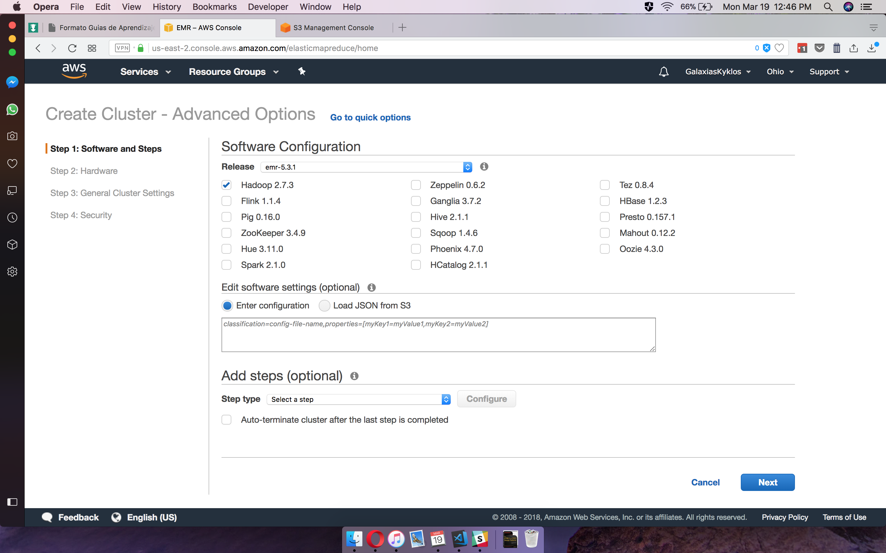
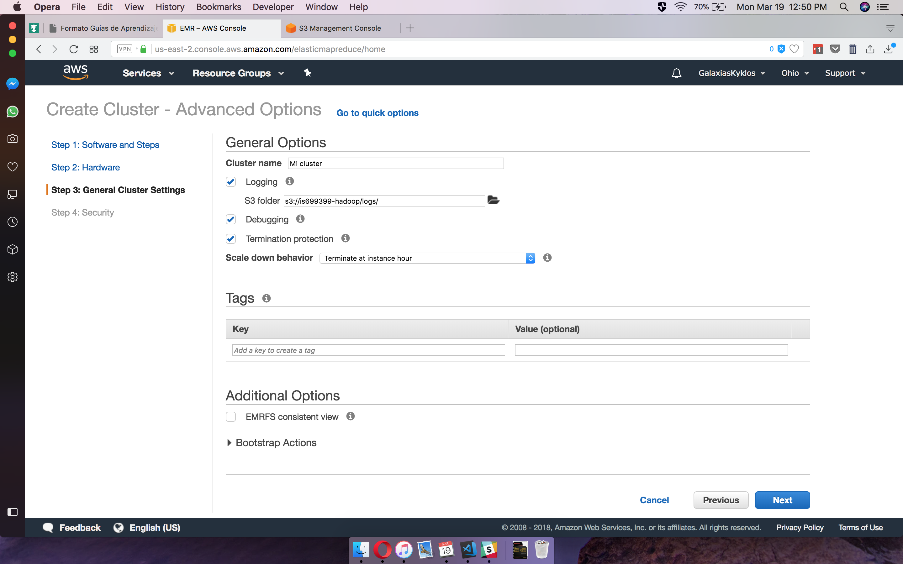
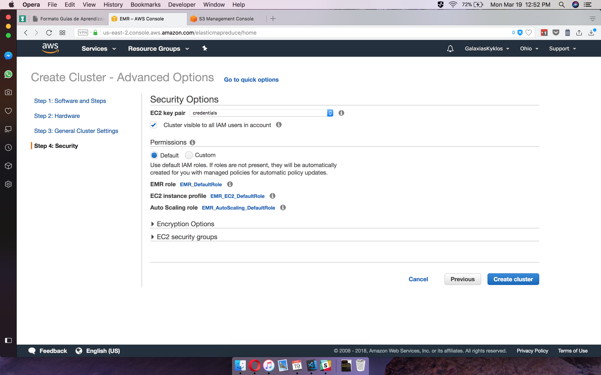
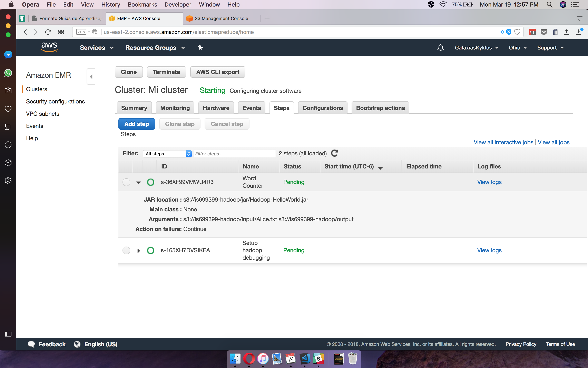
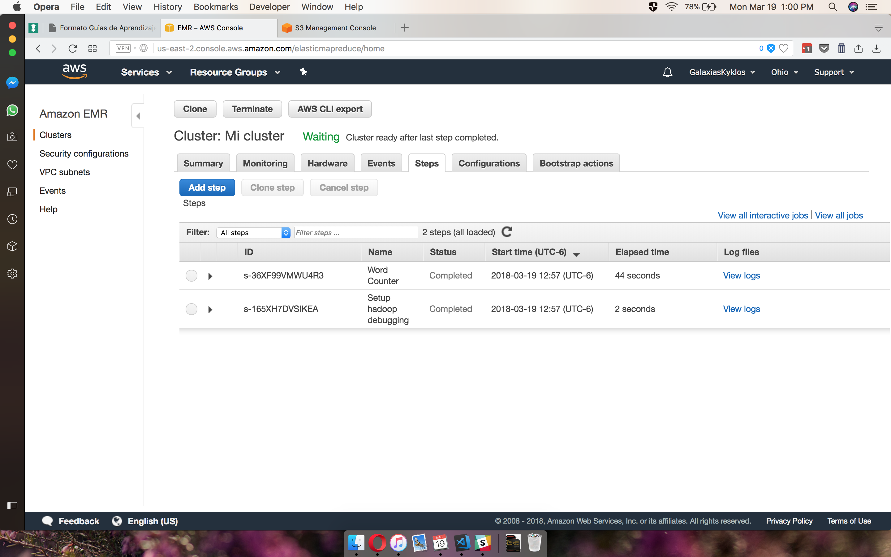
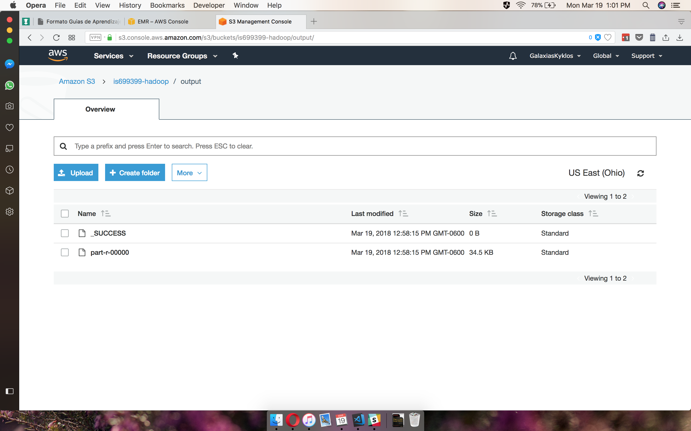

# Map-Reduce Hello World

## Saúl Ponce

## is699399

### What worked

- Everything

### Description

- The `src/` folder containes the source code of the `jar` used

- The `./part-r-00000` is the resulting file from the cluster

- Proofs of it working in AWS:

  - Setup: Software and Steps
    
  - Setup: Hardware
    
  - Setup: General Cluster Settings
    
  - Setup: Security
    
  - Steps
    
  - Completed
    
  - S3 Bucket after completion
    
